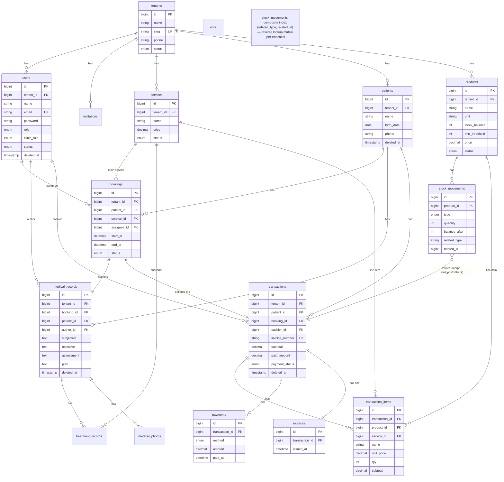

# ERD — Sistem Klinik Kecantikan (MVP)

ERD per tabel untuk fitur: Manajemen Pasien, Booking & Jadwal, Rekam Medis, Manajemen Layanan, Kasir (POS), Inventory, Laporan, Manajemen Pengguna.

Sumber kebenaran: [`specs/002-beauty-clinic-mvp/data-model.md`](../../specs/002-beauty-clinic-mvp/data-model.md) + [`specs/001-multi-tenant-single-db/data-model.md`](../../specs/001-multi-tenant-single-db/data-model.md).

## Konvensi

- Semua entitas bisnis = **tenant-scopeable** (`tenant_id` + `BelongsToTenant` + `TenantScope`), kecuali tabel platform (`tenants`, `audit_logs` native spatie).
- `created_at`/`updated_at` ada di setiap tabel kecuali dicatat (mis. `stock_movements` hanya `created_at`).
- Penamaan tabel & kolom snake_case; identifier English.
- Aktivitas perubahan data dicatat via `spatie/laravel-activitylog` (tabel `audit_logs`).
- **Soft delete wajib** pada entitas klinis & finansial: `users`, `patients`, `medical_records`, `transactions` (kolom `deleted_at`, via `$table->softDeletes()`). Hard-delete dilarang; nonaktif/arsip via `status`. Child record (`transaction_items`, `payments`, `invoices`, `treatment_records`, `medical_photos`) bertahan karena soft delete **tidak** memicu cascade DB.
- **FK delete rule**: FK yang menunjuk ke `users`/`patients`/`medical_records`/`transactions` → `restrictOnDelete` (bukan `cascadeOnDelete`), supaya penghapusan parent terblokir alih-alih menghapus data klinis/finansial beruntun. Pengecualian: FK ke `tenants` tetap `cascadeOnDelete` (hapus tenant = hapus semua datanya; di luar scope v1). Child admin (`transaction_items`, `payments`, `invoices`, `treatment_records`, `medical_photos`) → `cascadeOnDelete` aman karena parent di-soft-delete; cascade hanya saat hard-delete parent (kasus jarang/terlarang).

## Daftar Tabel

| Fitur | Tabel | File |
|-------|-------|------|
| Multi-tenant | `tenants` | [tenants.md](tenants.md) |
| Manajemen Pengguna | `users` | [users.md](users.md) |
| Manajemen Pengguna | `invitations` | [invitations.md](invitations.md) |
| Manajemen Pengguna | `audit_logs` | [audit_logs.md](audit_logs.md) |
| Manajemen Layanan | `services` | [services.md](services.md) |
| Manajemen Pasien | `patients` | [patients.md](patients.md) |
| Booking & Jadwal | `bookings` | [bookings.md](bookings.md) |
| Rekam Medis | `medical_records` | [medical_records.md](medical_records.md) |
| Rekam Medis | `treatment_records` | [treatment_records.md](treatment_records.md) |
| Rekam Medis | `medical_photos` | [medical_photos.md](medical_photos.md) |
| Inventory | `products` | [products.md](products.md) |
| Inventory | `stock_movements` | [stock_movements.md](stock_movements.md) |
| Kasir (POS) | `transactions` | [transactions.md](transactions.md) |
| Kasir (POS) | `transaction_items` | [transaction_items.md](transaction_items.md) |
| Kasir (POS) | `payments` | [payments.md](payments.md) |
| Kasir (POS) | `invoices` | [invoices.md](invoices.md) |

Laporan (omzet, penjualan treatment, penjualan produk) = turunan agregasi dari `transactions`, `transaction_items`, `payments` — tidak memiliki tabel tersendiri.

## Perubahan dari spec awal (improvement 2026-08-14)

Selisih dari `specs/002-beauty-clinic-mvp/data-model.md`. Implementasi migration/model belum diupdate — ini revisi ERD dulu.

1. **Soft delete** ditambah: `users`, `patients`, `medical_records`, `transactions` (kolom `deleted_at`).
2. **FK delete rule** diubah dari `cascadeOnDelete` → `restrictOnDelete` pada FK klinis/finansial (`bookings.assignee_id`/`patient_id`/`service_id`, `medical_records.booking_id`/`patient_id`/`author_id`, `transactions.patient_id`/`cashier_id`/`booking_id`, `transaction_items.product_id`/`service_id`, `treatment_records.service_id`, `stock_movements` via morph). FK ke `tenants` + child admin tetap `cascadeOnDelete`.
3. **`PaymentStatus`** enum ditambah state `partially_paid` (sebelumnya `unpaid`/`paid`) — split payment (FR-055) tidak lagi menyesatkan laporan omzet.
4. **`transactions.paid_amount`** kolom denormalized (sum `payments.amount`) — query status lunas/parsial tanpa SUM relasi tiap kali.
5. **`stock_movements`** morph index `(related_type, related_id)` via `nullableMorphs('related')` — reverse lookup mutasi per transaksi.
6. **`medical_records.(tenant_id, patient_id, created_at)`** index — query riwayat rekam medis per pasien (FR-022) tanpa full scan.
7. **`invoices`** ditandai YAGNI review — pertahankan hanya bila ada kebutuhan nomor invoice terpisah/multi-cetakan.

`ponytail:` item tanpa implementasi migration segera: soft-delete reconcile, audit-log JSON path index (saat skala terbukti lambat).

## Diagram Relasi (Mermaid)

