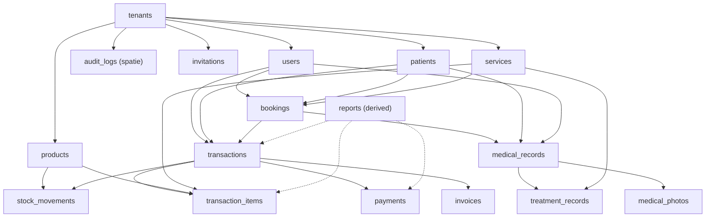

# Urutan Pengerjaan — dari ERD (Monorepo)

Urutan build turunan langsung dari **graf dependency foreign key** ERD (`docs/erd/*.md`). Aturan: tabel parent (FK target) harus selesai sebelum tabel child (FK source). Monorepo `apps/api` (Laravel BE) + `apps/web` (React/Inertia FE).

**Tim (CLAUDE.md):** BE Laravel → `ammar` (`/laravel-best-practices`). Tests → `zahiira`. FE → `sierly`. Push → `haikal` saat diminta (`/code-review` low).

**Deliverable per tabel (paket standar):**
- **BE (`apps/api`):** migration → model → enum (bila ada) → form request → controller → policy → API resource → route → factory → test.
- **FE (`apps/web`):** route/page Inertia → komponen → i18n key (Indonesia semi-formal) → breadcrumb (wajib CLAUDE.md).
- **Activity log** wajib tiap aksi data-changing, naratif via `LogAuditAction`.

**Verifikasi murah (tidak auto-run):** `php -l`, LSP. `php artisan migrate`/`test`, `npx tsc --noEmit --incremental` → user jalankan sendiri.

---

## Graf dependency (urutan topologis)

## Tabel tier (urutan build)

| Tier | Tabel | Dependency FK | Bisa paralel dalam tier? |
|------|-------|---------------|--------------------------|
| 0 | `tenants`, `audit_logs` | tidak ada (root/infra) | ya |
| 1 | `users`, `invitations` | tenants | ya |
| 2 | `services`, `patients`, `products` | tenants | ya |
| 3 | `bookings`, `transactions` | tenants + users + patients + services (+ bookings utk transactions) | bookings dulu, transactions setelahnya |
| 4 | `medical_records`, `transaction_items`, `payments`, `invoices`, `stock_movements` | tier 3 + tier 2 | ya (semua butuh tier 3 selesai) |
| 5 | `treatment_records`, `medical_photos` | medical_records + services | ya |
| — | `reports` (US8) | derived dari transactions/items/payments | terakhir, read-only |

---

## Urutan eksekusi (linear, deterministik)

Urutan ini cocok dengan timestamp migration existing (`apps/api/database/migrations`) — sudah valid topologis.

### Langkah 0 — Infra platform (ammar → zahiira)

| # | Tabel | Catatan |
|---|-------|---------|
| 1 | `tenants` | Root multi-tenant. Central tenant seed (`slug=central`). Slug unique. |
| 2 | `audit_logs` | spatie/laravel-activitylog, custom table + `App\Models\Activity`. Tidak ada FK DB (morph). Infra — sekali jadi, dipakai semua fitur. |

**Selesai:** registrasi tenant + login central jalan; audit log tercatat. FE: halaman login platform + dashboard central.

### Langkah 1 — Auth & organisasi (ammar → zahiira, paralel setelah L0)

| # | Tabel | Dependency | Catatan |
|---|-------|------------|---------|
| 3 | `users` | tenants | `role` + `clinic_role` + `status`. Admin pertama saat registrasi tenant. |
| 4 | `invitations` | tenants | Undang anggota; accept → buat user. |

**Selesai:** login tenant, undang/hapus/ubah peran staf, activity log naratif. FE: halaman login tenant, manajemen staf + undangan.

### Langkah 2 — Master data (ammar → zahiira, paralel)

| # | Tabel | Dependency | Catatan |
|---|-------|------------|---------|
| 5 | `services` | tenants | Master layanan. Arsip via `status`, bukan hapus. `price >= 0`. |
| 6 | `patients` | tenants | `phone` tidak unique (peringatan duplikat FR-023). |
| 7 | `products` | tenants | Master produk. `stock_balance` default 0, `min_threshold`. `is_low_stock` computed. |

**Selesai:** CRUD layanan/pasien/produk + arsip + duplikat phone warning. FE: 3 halaman master + breadcrumb.

### Langkah 3 — Operasional (ammar → zahiira, berurutan)

| # | Tabel | Dependency | Catatan |
|---|-------|------------|---------|
| 8 | `bookings` | tenants, patients, services, users | Assignee = doctor/therapist. Overlap detection (FR-035, tidak block). State `pending→confirmed→done`, `→cancelled`. |
| 9 | `transactions` | tenants, patients, users, bookings(nullable) | `invoice_number` unique per tenant. `payment_status`. `booking_id` nullable (link dari booking done). |

**Selesai:** booking + jadwal + overlap; transaksi POS baru. FE: kalender/jadwal booking, form booking, kasir POS.

### Langkah 4 — Child operasional (ammar → zahiira, paralel setelah L3)

| # | Tabel | Dependency | Catatan |
|---|-------|------------|---------|
| 10 | `medical_records` | tenants, bookings, patients, users | 1 per booking (unique `booking_id`). SOAP. Booking harus `done`. |
| 11 | `transaction_items` | tenants, transactions, products, services | Exclusive arc: product_id XOR service_id. Snapshot `name`+`unit_price` (R6). Stok adjust via `StockService`. |
| 12 | `payments` | tenants, transactions | Split payment. Update `paid_amount` + `payment_status` via `PayTransactionAction`. |
| 13 | `invoices` | tenants, transactions | 1 per transaction. Konten render dari relasi (R4). |
| 14 | `stock_movements` | tenants, products, morph transactions | Semua mutasi via `StockService::adjust()`. `balance_after` audit. Immutable. |

**Selesai:** rekam medis SOAP, line item POS, pembayaran multi-cicilan, invoice cetak, mutasi stok. FE: form rekam medis, halaman bayar + invoice, riwayat stok.

### Langkah 5 — Child klinis (ammar → zahiira, paralel setelah L4 #10)

| # | Tabel | Dependency | Catatan |
|---|-------|------------|---------|
| 15 | `treatment_records` | tenants, medical_records, services | `service_id` nullable (ad-hoc). `service_name` snapshot. |
| 16 | `medical_photos` | tenants, medical_records | Before/after. Path `medical-photos/{tenant}/{record}/{file}` (R3). |

**Selesai:** treatment aktual per rekam medis, upload foto before/after. FE: form treatment, uploader foto.

### Langkah 6 — Laporan (ammar → zahiira, setelah L3+L4)

| # | Fitur | Sumber | Catatan |
|---|-------|--------|---------|
| 17 | `reports` (US8) | transactions, transaction_items, payments | Omzet (FR-070), penjualan treatment (FR-071), penjualan produk (FR-072). Tidak punya tabel — derived agregasi. |

**Selesai:** 3 endpoint laporan + filter rentang. FE: dashboard laporan + chart. (Pakai skill `/dataviz` bila bikin chart.)

---

## Paralelisasi tim

```mermaid
gantt
    title Urutan pengerjaan tim (dependency-aware)
    dateFormat X
    axisFormat %s
    section Foundation
    L0 Infra (tenants+audit)   :a1, 0, 1
    L1 Auth (users+invitations) :a2, after a1, 1
    section Masters
    L2 services                 :b1, after a2, 1
    L2 patients                 :b2, after a2, 1
    L2 products                 :b3, after a2, 1
    section Operasional
    L3 bookings                 :c1, after b1 b2, 1
    L3 transactions             :c2, after c1, 1
    section Child
    L4 medical_records          :d1, after c1, 1
    L4 transaction_items        :d2, after c2 b1 b3, 1
    L4 payments                 :d3, after c2, 1
    L4 invoices                 :d4, after c2, 1
    L4 stock_movements          :d5, after b3 c2, 1
    section Klinis
    L5 treatment_records        :e1, after d1, 1
    L5 medical_photos           :e2, after d1, 1
    section Laporan
    L6 reports                  :f1, after c2 d2 d3, 1
```

**Aturan paralel:**
- L0 → L1 serial (auth butuh infra).
- L2: 3 master **paralel** (ammar ambil 1, tim/agent lain 2 sisanya) — semua butuh L1 selesai.
- L3: **bookings dulu** (transactions butuh bookings FK).
- L4: **paralel penuh** setelah L3 selesai — 5 child indep.
- L5: paralel setelah `medical_records` (L4 #10) selesai.
- L6: setelah transactions + items + payments ada.
- FE (`sierly`) **mengikuti** tiap langkah BE — mulai FE langkah N saat BE langkah N selesai, bukan tunggu semua.

## Catatan

- Urutan ini = **urutan dependency FK**, bukan prioritas bisnis. Untuk prioritas revisi/improvement (soft delete, FK restrict, `paid_amount` 3-state), lihat [`docs/normalization/feature-workflow.md`](../normalization/feature-workflow.md) — itu overlay di atas urutan ini.
- Tabel yang sudah ada migration-nya (`apps/api/database/migrations`) mengikuti urutan ini — verifikasi tidak perlu rework migration order.
- `audit_logs` di L0 karena infra (dipakai semua fitur via `LogAuditAction`), meski morph-nya baru terisi saat aktor/subjek ada di L1+.
- `personal_access_tokens` (sanctum) di L1 bareng users — bukan tabel ERD bisnis, jangan keliru.