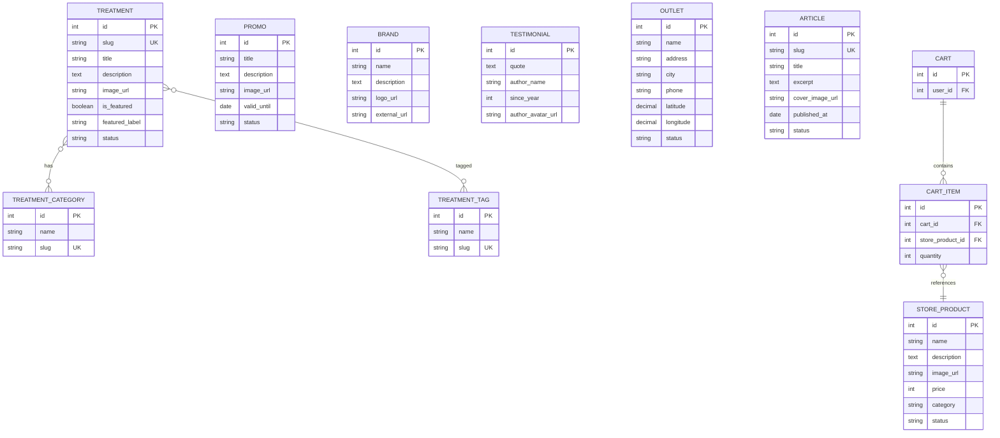

# Zapclinic Company Profile — ERD

Diturunkan dari landing page `https://zapclinic.com/` (2026-08-14). Hanya entitas yang teramati di UI. Landing page company profile — tidak ada submit form, jadi model data bersifat read-only display.

Catatan:
- `TREATMENT_CATEGORY` / `TREATMENT_TAG` dimodel many-to-many karena satu treatment menampilkan multiple tag (contoh: "rejuvenation", "brightening", "oily skin"). Hubungannya junction table implisit.
- `OUTLET` diturunkan dari klaim "100+ outlet" + menu "Lokasi" (`/locations`) — tidak ada detail field teramati, kolom adalah perkiraan standar untuk pencarian lokasi.
- `STORE_PRODUCT`, `CART`, `CART_ITEM` diturunkan dari E-Store (`/store`) + ikon cart dengan badge count di header.
- `ARTICLE` diturunkan dari menu "Artikel" (`/articles`) — field perkiraan untuk blog company profile.
- `PROMO` field `valid_until` dari teks "Sampai 15 September 2026" pada hero.
- Widget chat (Qiscus) adalah layanan eksternal, tidak dimodel di sini.