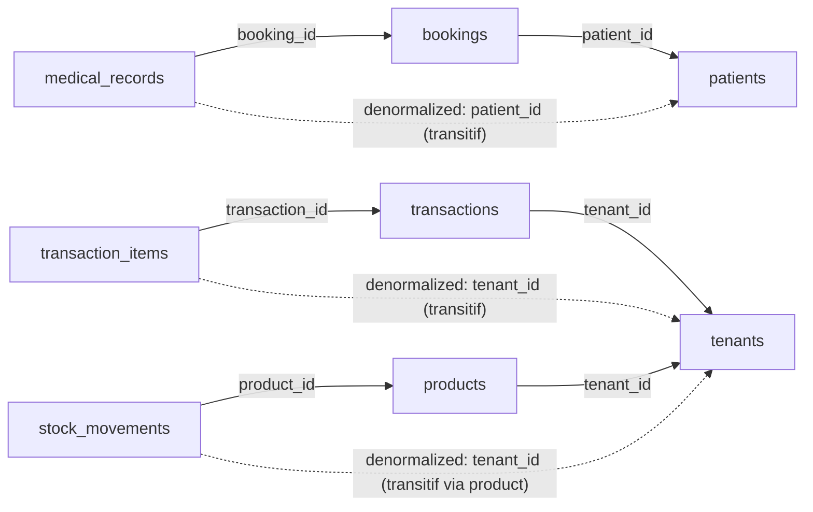

# Normalisasi Skema — Sistem Klinik Kecantikan (MVP)

Analisis bentuk normal skema di [`docs/erd/`](../erd/) terhadap 1NF/2NF/3NF/BCNF. Tujuan: memisahkan **denormalisasi intensional** (terkontrol, berjustifikasi R-rule) dari **anomali asli** (redudansi tidak terjaga / pelanggaran bentuk normal yang perlu diperbaiki).

Sumber: ERD revisi 2026-08-14 + implementasi `apps/api/database/migrations`.

## Kesimpulan

Skema **memenuhi 3NF** untuk semua entitas inti. BCNF dilanggar oleh beberapa **dependensi transitif intensional** (denormalized kolom untuk performa query per-tenant dan riwayat historik). Semua pelanggaran didokumentasikan + ada mekanisme jaga-konsistensi (DB transaction / Service / snapshot immutable). **Anomali asli** yang perlu tindakan: 3 item (lihat [Anomali asli](#anomali-asli-yang-perlu-tindakan)).

Tidak ada pelanggaran 1NF/2NF.

---

## Analisis per bentuk normal

### 1NF — nilai atomik

| Cek | Hasil |
|-----|-------|
| Kolom multi-valued / array | TIDAK ADA |
| Grup berulang di satu baris | TIDAK ADA |
| Urutan baris bermakna (pakai PK) | OK — semua tabel punya `id` PK |

**Pengecualian tercatan (bukan pelanggaran, desain sadar):**
- `audit_logs.properties` (JSON) menyimpan context aksi (`tenant_id`, slug, status lama/baru, ip). JSON non-atomik secara teknis, tapi kolom JSON didukung DB modern + tidak di-query per-key di hot path (`ponytail: JSON path index add saat lambat`). Diterima. Kolom ini ada di kedua impl: native (`App\Models\AuditLog`, `properties` cast `array`) maupun target spatie (`withProperties([...])`, field native spatie). Lihat [`audit_logs.md`](../erd/audit_logs.md).

### 2NF — tanpa dependensi parsial (hanya relevan untuk composite PK)

Semua tabel pakai surrogate `id` (single-column PK), jadi **dependensi parsial tidak mungkin**. Composite constraint yang ada (`unique(tenant_id, invoice_number)`, `unique(tenant_id, booking_id)`) adalah **unique constraint + index**, bukan PK — tidak menimbulkan dependensi parsial.

Hasil: **2NF terpenuhi** otomatis.

### 3NF — tanpa dependensi transitif (non-key → non-key)

Inilah area utama. Dependensi transitif yang ada:

Setiap panah putus-putus = dependensi transitif = pelanggaran 3NF secara teknis. Rinciannya di [Denormalisasi intensional](#denormalisasi-intensional-terkontrol).

### BCNF — setiap determinan adalah superkey

Pelanggaran BCNF = pelanggaran 3NF di atas, semua pada denormalized kolom. Tidak ada pelanggar BCNF tambahan di luar itu. Hubungan 1:1 (`invoices`↔`transactions`, `medical_records`↔`bookings`) dibahas di [Hubungan 1:1](#hubungan-11--kandidat-merge).

---

## Denormalisasi intensional (terkontrol)

Semua item ini **melanggar 3NF/BCNF secara teknis tapi disengaja**, dengan justifikasi + mekanisme jaga-konsistensi. Dipertahankan.

| Kolom denormalized | Sumber kebenaran (normalisasi murni) | Justifikasi | Jaga-konsistensi |
|--------------------|--------------------------------------|-------------|------------------|
| `transaction_items.name`, `unit_price` | `products.name`/`price`, `services.name`/`price` | R6/FR-056: transaksi lama tetap utuh walau master diubah/arsip | Snapshot immutable — sekali tulis, tidak di-update. Tidak ada sinkron. |
| `treatment_records.service_name` | `services.name` | R6 spirit: riwayat treatment tetap walau layanan diubah | Snapshot immutable. |
| `transactions.subtotal` | `SUM(transaction_items.subtotal)` | Hindari join+sum setiap query transaksi/laporan | Dihitung saat simpan transaksi (DB transaction). `ponytail: reconcile add saat drift`. |
| `transactions.paid_amount` (baru) | `SUM(payments.amount)` | Status lunas/parsial tanpa SUM relasi tiap query laporan omzet (FR-070) | `PayTransactionAction` update dalam DB transaction bersama payment. |
| `transaction_items.subtotal` | `unit_price * qty` | Computed, disimpan supaya bisa di-query/agregasi langsung | Dihitung saat simpan; immutable setelahnya. |
| `products.stock_balance` | `SUM(stock_movements)` in−out | R7: satu sumber saldo, hindari running-sum per query | Hanya diubah via `StockService::adjust()` dalam DB transaction + `balance_after` audit. `ponytail: reconcile job add saat drift`. |
| `stock_movements.balance_after` | Running sum movement sebelumnya | Audit immutable: saldo saat mutasi tanpa recompute | Immutable (hanya `created_at`); sekali tulis. |
| `medical_records.patient_id` | `bookings.patient_id` (via `booking_id`) | FR-022: query riwayat rekam medis per pasien tanpa join ke bookings | Ditetapkan saat buat record dari booking. **Risiko:** bila `bookings.patient_id` diubah setelah record ada → drift. Lihat [Anomali #2](#2-medical_recordspatient_id-risiko-drift-saat-bookingpatient_id-diubah). |
| `tenant_id` di semua child tabel | FK chain (mis. `transaction_items.tenant_id` = `transactions.tenant_id` = `tenants.id`) | Multi-tenant single-DB: scope isolation + filter per tenant tanpa join naik ke root | App-level invariant: child.tenant_id == parent.tenant_id. `ponytail: CHECK constraint add saat DB mendukung`. Lihat [Anomali #3](#3-tenant_id-child-tidak-di-enforce-sama-dengan-parent). |

---

## Anomali asli yang perlu tindakan

Pelanggaran/anomali yang **tidak** berjustifikasi kuat atau tidak terjaga. Urut prioritas.

### 1. `transaction_items` exclusive arc tanpa DB enforcement

**Pelanggaran:** tabel punya `product_id` DAN `service_id` (dua nullable FK). Business rule: **salah satu** terisi (item = produk ATAU layanan). Tidak ada DB constraint yang memaksa ini — hanya app validation di FormRequest (`transaction_items.md`).

**Risiko:** insert langsung (seed, job, bug) bisa buat item dengan keduanya null atau keduanya terisi → laporan penjualan treatment (FR-071) / produk (FR-072) meleset.

**Rekomendasi (lazy, sesuai stack):**
- **Preferred:** CHECK constraint DB-level: `CHECK ((product_id IS NULL) <> (service_id IS NULL))` — memaksa tepat satu terisi. MySQL 8+/PostgreSQL mendukung.
- Atau morph single: `item_type` + `item_id` + `item_class` (lebih normal, tapi query laporan jadi polimorfik — trade-off tidak sepadan untuk MVP).
- App validation tetap pertahanan UX; CHECK = pertahanan integritas data.

### 2. `medical_records.patient_id` risiko drift saat `bookings.patient_id` diubah

**Pelanggaran:** `medical_records.patient_id` adalah denormalized transitif dari `bookings.patient_id`. Bila booking patient diubah setelah medical record dibuat, rekam medis menunjuk pasien lama → riwayat pasien (FR-022) terbelah.

**Risiko:** rendah di MVP (booking jarang dipindah pasien setelah `done`), tapi anomali diam-diam.

**Rekomendasi:**
- **Preferred:** setelah medical record ada, `bookings.patient_id` jadi **immutable** (Policy/FormRequest tolak ubah bila `medicalRecord` exists). Tidak butuh kolom baru.
- Atau: bila booking patient boleh diubah, propagate ke `medical_records.patient_id` dalam DB transaction yang sama.
- Catat invariant di `medical_records.md` (sudah disebut denormalized, tambah catatan immutability).

### 3. `tenant_id` child tidak di-enforce sama dengan parent

**Pelanggaran:** multi-tenant denormalisasi intensional, tapi tidak ada DB guarantee bahwa `transaction_items.tenant_id == transactions.tenant_id`. Bug/seed bisa buat child lintas-tenant dari parent-nya → data bocor tenant.

**Risiko:** isolasi tenant (spec 001 inti) bisa bobol diam-diam.

**Rekomendasi:**
- **Preferred:** CHECK constraint per child: `CHECK (tenant_id = (SELECT tenant_id FROM <parent> WHERE id = <parent_id>))` — tapi CHECK dengan subquery tidak didukung semua DB. Alternatif: trigger, atau validasi app ketat di Service layer (sudah ada via `BelongsToTenant` + `TenantScope` saat create lewat relasi).
- **Pragmatic MVP:** pertahankan app-level enforcement (`BelongsToTenant` trait + selalu create child via relasi `$transaction->items()->create()` yang otomatis inherit `tenant_id`). Tambah **test** (one assert) yang verifikasi child tidak bisa lintas-tenant.
- `ponytail: DB-level CHECK/trigger add saat audit keamanan tenant berikutnya`.

---

## Hubungan 1:1 — kandidat merge (BCNF lebih pure)

### `invoices` ↔ `transactions` (1:1)

- `invoices` = `transaction_id` (unique) + `issued_at`. Nyaris tanpa kolom sendiri.
- Normalisasi murni: **merge** `issued_at` ke `transactions`, hapus tabel `invoices` (1:1 tanpa atribut tambahan = tidak pernah terpisah secara BCNF).
- **Tapi** pertahankan bila ada kebutuhan nyata: nomor invoice terpisah dari `invoice_number` transaksi, multi-cetakan per transaksi, atau status cetak/terkirim. Tanpa kebutuhan itu → merge (YAGNI, sudah dicatat di `invoices.md`).
- **Rekomendasi:** putuskan sebelum implementasi migration final. Default MVP: **merge** `issued_at` ke `transactions`, drop `invoices`.

### `medical_records` ↔ `bookings` (1:1, unique `booking_id`)

- `medical_records.booking_id` unique = 1 record per booking (R10).
- Bisa di-merge ke `bookings`? **Tidak disarankan.** `medical_records` adalah **aggregate root** untuk `treatment_records` + `medical_photos` (hasMany). Bila di-merge, `bookings` jadi bloated + FK `treatment_records`/`medical_photos` harus tunjuk ke `bookings` (semantik kacau: treatment bukan anak booking, anak rekam medis).
- **Rekomendasi:** pertahankan terpisah. Ini aggregate boundary, bukan anomali normalisasi.

---

## Ringkasan skor per tabel

| Tabel | 1NF | 2NF | 3NF | BCNF | Catatan |
|-------|-----|-----|-----|------|---------|
| `tenants` | OK | OK | OK | OK | bersih |
| `users` | OK | OK | OK | OK | dual-role (`role`+`clinic_role`) design, enforce app-level |
| `invitations` | OK | OK | OK | OK | bersih |
| `audit_logs` | OK* | OK | OK | OK | *JSON `properties` non-atomik terkontrol (native saat ini, target spatie — lihat `audit_logs.md`) |
| `services` | OK | OK | OK | OK | bersih |
| `patients` | OK | OK | OK | OK | bersih |
| `bookings` | OK | OK | OK | OK | bersih |
| `medical_records` | OK | OK | 3NF† | 3NF† | †`patient_id` transitif intensional (anomali #2) |
| `treatment_records` | OK | OK | OK | OK | `service_name` snapshot intensional |
| `medical_photos` | OK | OK | OK | OK | bersih |
| `products` | OK | OK | 3NF† | 3NF† | †`stock_balance` redundant intensional (R7) |
| `stock_movements` | OK | OK | 3NF† | 3NF† | †`tenant_id`+`balance_after` redundant intensional |
| `transactions` | OK | OK | 3NF† | 3NF† | †`subtotal`+`paid_amount` redundant intensional |
| `transaction_items` | OK | OK | 3NF† | 3NF† | †`tenant_id`+`subtotal`+snapshot intensional; **anomali #1** (exclusive arc) |
| `payments` | OK | OK | 3NF† | 3NF† | †`tenant_id` transitif intensional |
| `invoices` | OK | OK | OK | OK | kandidat merge ke `transactions` (YAGNI) |

† = pelanggaran intensional terkontrol (lihat [Denormalisasi intensional](#denormalisasi-intensional-terkontrol)), bukan anomali asli — kecuali yang ditautkan ke [Anomali](#anomali-asli-yang-perlu-tindakan).

---

## Rekomendasi tindak lanjut

| Prioritas | Item | Aksi | Implementasi |
|-----------|------|------|--------------|
| Tinggi | Anomali #1 exclusive arc | CHECK constraint `(product_id IS NULL) <> (service_id IS NULL)` | migration + verifikasi |
| Tinggi | Anomali #3 tenant_id child | test assert child tidak bisa lintas-tenant | test file |
| Sedang | Anomali #2 medical_records drift | immutability `bookings.patient_id` bila record ada | Policy/FormRequest |
| Sedang | `invoices` merge | putuskan: merge `issued_at` ke `transactions` / pertahankan | keputusan + migration |
| Rendah | reconcile denormalized | job reconcile `stock_balance`/`subtotal`/`paid_amount` saat drift | `ponytail`, add saat butuh |

`ponytail:` item normalisasi yang ditunda (CHECK subquery tenant, JSON index, reconcile job) — add saat skala/audit membuktikan butuh, bukan sekarang.