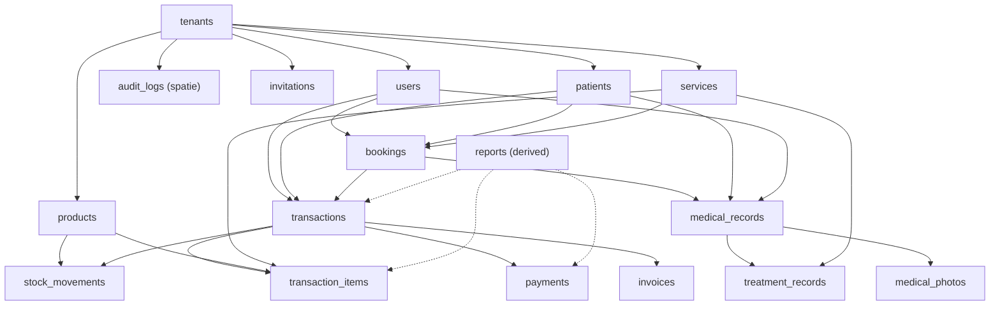

# Workflow Pengerjaan — Implementasi dari ERD

Langkah eksekusi dari ERD ([`docs/erd/`](../erd/), revisi 2026-08-14) untuk monorepo `apps/api` (Laravel BE) + `apps/web` (React/Inertia FE). Urutan diturunkan dari **graf dependency foreign key** tabel ERD — parent selesai sebelum child — dengan revisi normalisasi ([`README.md`](./README.md)) dilampirkan per tabel.

**Prinsip:** shortest diff, dependency strict, verifikasi objektif per stack (`php -l`, `npx tsc --noEmit --incremental`), tidak ada langkah tanpa kriteria selesai.

**Tim (CLAUDE.md):** BE Laravel → `ammar` (`/laravel-best-practices`, `/clean-code-principles`). Tests → `zahiira`. FE → `sierly`. Push → `haikal` saat diminta (`/code-review` low). Paralel antar fitur indep dalam satu tier; serial antar tier dependency.

**Deliverable paket standar per tabel (BE):** migration → model → enum (bila ada) → form request → controller → policy → API resource → route → factory → test. **Per fitur (FE):** route/page Inertia → komponen → i18n key (Indonesia semi-formal) → breadcrumb (wajib). **Activity log** naratif wajib tiap aksi data-changing via `LogAuditAction`.

**Verifikasi murah (tidak auto-run build/migrate/test tanpa perintah user):** `php -l`, LSP diagnostics. `php artisan migrate`/`test`, `npx tsc --noEmit --incremental` → user jalankan sendiri.

## Keputusan blocking (F0, sebelum eksekusi apapun)

Putuskan **`invoices`**: merge `issued_at` ke `transactions` + drop tabel (default MVP, YAGNI), atau pertahankan. Lihat [normalisasi §Hubungan 1:1](./README.md#hubungan-11--kandidat-merge-bcnf-lebih-pure).

- **Owner:** user. **Keluaran:** update `docs/erd/invoices.md` + `docs/erd/README.md` changelog.
- Mempengaruhi langkah 9 (transactions) + 13 (invoices) di bawah.

## Graf dependency (urutan topologis)

## Revisi normalisasi (dilampirkan per tabel)

Revisi ini dikerjakan **bersama** langkah tabelnya, bukan fase terpisah. Sumber: [`README.md`](./README.md) anomali #1–#3 + denormalisasi intensional.

| Revisi | Tabel langkah | Isi |
|--------|---------------|-----|
| Soft delete | 3,6,8,9 | `deleted_at` pada `users`,`patients`,`medical_records`,`transactions` |
| FK `restrictOnDelete` | 8,9,10,11,14,15 | ganti cascade/nullOnDelete pada FK klinis/finansial (daftar per langkah) |
| `PaymentStatus` 3-state + `paid_amount` | 9,12 | enum + kolom denormalized + sync `PayTransactionAction` |
| Exclusive arc CHECK (anomali #1) | 11 | `transaction_items CHECK ((product_id IS NULL) <> (service_id IS NULL))` |
| Immutability booking patient (anomali #2) | 8 | tolak ubah `patient_id` bila medical record ada |
| Tenant-id invariant (anomali #3) | 11,12,14,15 | child create via relasi supaya `tenant_id` inherit |
| Morph `nullableMorphs('related')` | 14 | `stock_movements` + composite index `(related_type,related_id)` |
| Index `medical_records(tenant_id,patient_id,created_at)` | 10 | query riwayat pasien (FR-022) |

---

## Langkah eksekusi (urutan build)

### L0 — Infra platform

**Langkah 1 — `tenants`** (`ammar` → `zahiira`)
- Root multi-tenant. Central tenant seed (`slug=central`). Slug unique (FR-004/005). `status` active/inactive.
- **Revisi:** FK `tenant_id` di semua child tetap `cascadeOnDelete` (pengecualian: hapus tenant = hapus semua datanya, di luar scope v1).
- **AC:** registrasi tenant + login central jalan; slug reject non-URL-safe; activity log tercatat.
- **FE (`sierly`):** halaman login platform + dashboard central + breadcrumb.

**Langkah 2 — `audit_logs`** (`ammar`)
- spatie/laravel-activitylog, custom table `audit_logs` + `App\Models\Activity`. Tidak ada FK DB (morph). Infra — sekali jadi, dipakai semua fitur via `LogAuditAction`.
- **Revisi:** tidak ada. Morph `causer`/`subject` tetap (user/pasien soft-delete tidak memutus audit).
- **AC:** `Activity::where('properties->tenant_id', …)` jalan; `ponytail: JSON path index add saat lambat`.

### L1 — Auth & organisasi (paralel setelah L0)

**Langkah 3 — `users`** (`ammar` → `zahiira`)
- `role` (platform_admin/tenant_admin/member) + `clinic_role` (admin/doctor/therapist/cashier) + `status`. Admin pertama saat registrasi tenant. Email unique global (FR-015).
- **Revisi:** soft delete (`deleted_at`); index `(tenant_id, deleted_at)`. `RemoveUserAction` ganti hard-delete → soft delete + `status=inactive`. FK dari `bookings.assignee_id`/`medical_records.author_id`/`transactions.cashier_id` → `restrictOnDelete`.
- **AC:** login tenant + undang/hapus/ubah peran staf; admin terakhir tidak bisa dinonaktifkan (FR-005/025); staf ter-soft-delete tidak muncul di list aktif; activity log naratif "Menonaktifkan staf {name} — peran {role}".
- **FE:** halaman login tenant, manajemen staf + undangan + breadcrumb.

**Langkah 4 — `invitations`** (`ammar` → `zahiira`)
- Undang anggota; `token` unique; `status` pending/accepted/cancelled/expired. Accept → buat user.
- **Revisi:** tidak ada.
- **AC:** tolak undang email sudah user aktif di tenant sama (FR-022); batalkan/expire; activity log.

### L2 — Master data (paralel penuh setelah L1)

**Langkah 5 — `services`** (`ammar` → `zahiira`)
- Master layanan. `price >= 0` (FR-011). Arsip via `status=archived`, bukan hapus (FR-013). Index `(tenant_id, status)`.
- **Revisi:** FK `bookings.service_id`/`treatment_records.service_id`/`transaction_items.service_id` → `restrictOnDelete`. Snapshot `name`+`unit_price`/`service_name` tetap utuh walau arsip (R6) — verifikasi tidak ada path sync snapshot ke master.
- **AC:** CRUD + arsip; arsip tidak muncul di pilihan booking baru; hard-delete layanan direferensi → diblokir restrict; activity log "Mengarsipkan layanan {name}".
- **FE:** halaman master layanan + breadcrumb.

**Langkah 6 — `patients`** (`ammar` → `zahiira`)
- `phone` tidak unique (peringatan duplikat FR-023). Index `(tenant_id, phone)`.
- **Revisi:** soft delete (`deleted_at`); index `(tenant_id, deleted_at)`. Tambah aksi nonaktifkan (soft delete) — route saat ini `except(['destroy'])`, mungkin perlu `destroy` soft-delete. FK dari `bookings`/`medical_records`/`transactions` → `restrictOnDelete`.
- **AC:** CRUD + duplikat phone warning; soft-delete pasien → riwayat tetap utuh + tidak muncul di list aktif; hard-delete diblokir restrict; activity log "Menonaktifkan pasien {name}".
- **FE:** halaman master pasien + riwayat + breadcrumb.

**Langkah 7 — `products`** (`ammar` → `zahiira`)
- Master produk. `stock_balance` default 0, `min_threshold` (FR-065), `is_low_stock` computed. Arsip via `status=archived` (FR-066).
- **Revisi:** FK `stock_movements.product_id`/`transaction_items.product_id` → `restrictOnDelete`. `stock_balance` hanya diubah via `StockService::adjust()` (R7) — verifikasi tidak ada path update langsung.
- **AC:** CRUD + arsip + low-stock indicator; hard-delete produk direferensi → diblokir restrict; activity log.
- **FE:** halaman master produk + breadcrumb.

### L3 — Operasional (berurutan)

**Langkah 8 — `bookings`** (`ammar` → `zahiira`) — setelah L2 #5,#6
- Assignee = doctor/therapist. Overlap detection (FR-035, tidak block, flag `overlap_warnings`). State `pending→confirmed→done`, `→cancelled` (FR-031); `done` tidak `→cancelled`. Index `(tenant_id,assignee_id,start_at,end_at)` + `(tenant_id,start_at)`.
- **Revisi:** FK `patient_id`/`assignee_id`/`service_id` → `restrictOnDelete`. Booking tidak soft delete (`status=cancelled` cukup). **Anomali #2 — immutability `patient_id`:** tolak ubah `patient_id` bila `medicalRecord` exists, di FormRequest/Policy → 422.
- **AC:** booking + jadwal + overlap warning; ubah `patient_id` pada booking ada medical record → 422; state transition enforced; activity log naratif status lama→baru.
- **FE:** kalender/jadwal + form booking + breadcrumb; disable ubah pasien bila medical record ada (UX mencegah 422).

**Langkah 9 — `transactions`** (`ammar` → `zahiira`) — setelah #8
- `invoice_number` unique per tenant, generate `INV-YYYYMMDD-XXXX`. `payment_status`. `booking_id` nullable (link dari booking done, FR-033). Index `(tenant_id,invoice_number)` + `(tenant_id,payment_status,created_at)`.
- **Revisi:** soft delete (`deleted_at`); index `(tenant_id, deleted_at)`. Kolom baru `paid_amount decimal(12,2) default 0 not null`; `issued_at` (bila F0 = merge invoices). FK `patient_id`/`cashier_id`/`booking_id` → `restrictOnDelete`. `invoice_number` race fix: `generateInvoiceNumber()` `count()+1` → `lockForUpdate` dalam DB transaction / sequence per tenant per hari.
- **AC:** transaksi POS baru + link booking; invoice number unik walau concurrent; soft-delete transaksi; activity log "Mencatat pembayaran … status {lama}→{baru}".
- **FE:** kasir POS + badge `payment_status` 3-state + `paid_amount` vs `subtotal` + sisa bayar + label i18n `clinic.payment_status.partially_paid` + breadcrumb.

### L4 — Child operasional (paralel penuh setelah L3)

**Langkah 10 — `medical_records`** (`ammar` → `zahiira`) — setelah #8
- 1 per booking (unique `booking_id`, R10). SOAP. Booking harus `done` (FR-033/040). Hanya doctor/therapist/admin (FR-044, Policy).
- **Revisi:** soft delete (`deleted_at`). FK `booking_id`/`patient_id`/`author_id` → `restrictOnDelete` (bukan cascade). Index baru `(tenant_id, patient_id, created_at)` untuk FR-022. `patient_id` denormalized dari booking — immutable setelah record ada (kaitan anomali #2).
- **AC:** soft-delete rekam medis → treatment/photo tetap; hard-delete diblokir restrict; query riwayat per pasien pakai index; activity log "Mengisi rekam medis pasien {patient}".
- **FE:** form rekam medis SOAP + breadcrumb.

**Langkah 11 — `transaction_items`** (`ammar` → `zahiira`) — setelah #9, #5, #7
- Exclusive arc: `product_id` XOR `service_id`. Snapshot `name`+`unit_price` (R6/FR-056). Stok produk check (FR-053) + adjust (FR-052) via `StockService`. Index `(tenant_id,transaction_id)`, `(tenant_id,product_id)`, `(tenant_id,service_id)`.
- **Revisi:** **Anomali #1 — CHECK constraint** `(product_id IS NULL) <> (service_id IS NULL)` + app validation di `TransactionRequest`. FK `product_id`/`service_id` → `restrictOnDelete`; `transaction_id` cascade (child admin). **Anomali #3 — tenant-id invariant:** create via `$transaction->items()->create()` supaya `tenant_id` inherit.
- **AC:** item dengan product+service keduanya null/terisi → ditolak (CHECK + 422); snapshot immutability (ubah `services.price` tidak ubah `unit_price` historik); child tidak bisa lintas-tenant.
- **FE:** line item POS (bagian dari FE langkah 9).

**Langkah 12 — `payments`** (`ammar` → `zahiira`) — setelah #9
- Split payment (cicilan). `method` (cash/transfer/qris/debit). `paid_at` untuk laporan omzet.
- **Revisi:** **`PaymentStatus` 3-state** (tambah `partially_paid`) + `paid_amount` sync — `PayTransactionAction`: setelah `payments()->create`, `transaction.paid_amount += amount` lalu set status (`paid` bila `>= subtotal`, `partially_paid` bila `0 < < subtotal`, `unpaid` bila 0) dalam satu DB transaction. FK `transaction_id` cascade (child admin). **Anomali #3 — tenant-id invariant:** create via `$transaction->payments()->create()`.
- **AC:** 3 payment parsial (subtotal 300rb) → `paid_amount` akumulatif + status `unpaid→partially_paid→paid`; overpaid → peringatan; activity log.
- **FE:** halaman bayar + multi-cicilan + breadcrumb (bagian FE langkah 9).

**Langkah 13 — `invoices`** (`ammar` → `zahiira`) — setelah #9
- 1 per transaction. Konten render dari relasi (R4) — tidak duplikat kolom.
- **Revisi:** tergantung F0. Bila merge → skip tabel, `issued_at` di transactions, `InvoiceController::show` render dari transaction. Bila pertahankan → FK `transaction_id` cascade (child admin), index `transaction_id` unique.
- **AC:** invoice cetak (R4); bila merge: `issued_at` terisi saat issue; activity log.
- **FE:** halaman/tombol cetak invoice + breadcrumb.

**Langkah 14 — `stock_movements`** (`ammar` → `zahiira`) — setelah #7, #9
- Semua mutasi via `StockService::adjust()` dalam DB transaction + row lock (R7). `balance_after` audit. Immutable (hanya `created_at`). Index `(tenant_id,product_id,created_at)`.
- **Revisi:** ganti `related_type`/`related_id` manual → `nullableMorphs('related')` (kolom + composite index `(related_type,related_id)`). `StockService::adjust` create pakai morph map konsisten. FK `product_id` → `restrictOnDelete`. **Anomali #3 — tenant-id invariant:** `tenant_id` inherit dari product (sudah via `StockService`).
- **AC:** stock in/out → `balance_after` konsisten + `stock_balance` update; rollback saat cancel transaksi → stok kembali; reverse lookup per transaksi pakai morph index; activity log "Menyesuaikan stok {product} — {type} {qty}".
- **FE:** riwayat stok per produk + breadcrumb.

### L5 — Child klinis (paralel setelah #10)

**Langkah 15 — `treatment_records`** (`ammar` → `zahiira`) — setelah #10
- `service_id` nullable (ad-hoc, FR-041). `service_name` snapshot (R6). Catatan klinis.
- **Revisi:** FK `medical_record_id` cascade (child admin); `service_id` → `restrictOnDelete`.
- **AC:** treatment per rekam medis; snapshot tetap walau layanan arsip; activity log.
- **FE:** form treatment + breadcrumb.

**Langkah 16 — `medical_photos`** (`ammar` → `zahiira`) — setelah #10
- Before/after (FR-042). Path `medical-photos/{tenant}/{record}/{file}` (R3). Upload `image|mimes:jpg,jpeg,png|max:2048`.
- **Revisi:** FK `medical_record_id` cascade (child admin). Saat `MedicalRecord` soft-delete, file fisik di-queue cleanup (listener/observer), bukan cascade DB.
- **AC:** upload foto before/after (R3 path); file cleanup saat record soft-delete (queue); activity log.
- **FE:** uploader foto before/after + breadcrumb.

### L6 — Laporan (setelah L3 + L4)

**Langkah 17 — `reports` (US8, derived)** (`ammar` → `zahiira`) — setelah #9, #11, #12
- Tidak punya tabel — derived dari `transactions`/`transaction_items`/`payments`. Omzet (FR-070), penjualan treatment (FR-071), penjualan produk (FR-072). Filter rentang.
- **Revisi:** omzet lunas = transaksi `payment_status=paid` per rentang (index `(tenant_id,payment_status,created_at)`); `partially_paid` default exclude (opsi include parsial bila diminta); manfaatkan `paid_amount` denormalized. Laporan treatment/produk dari `transaction_items` — exclusive arc (anomali #1) tidak mendouble-count. Read-only, tidak ada activity log.
- **AC:** omzet per rentang hanya hitung `paid`; `partially_paid` exclude; treatment vs produk tidak overlap.
- **FE:** dashboard laporan + chart (skill `/dataviz`) + breadcrumb.

---

## Paralelisasi tim

```mermaid
gantt
    title Urutan pengerjaan tim (dependency-aware)
    dateFormat X
    axisFormat %s
    section L0 Infra
    1 tenants            :a1, 0, 1
    2 audit_logs         :a2, after a1, 1
    section L1 Auth
    3 users              :b1, after a2, 1
    4 invitations        :b2, after a2, 1
    section L2 Masters
    5 services           :c1, after b1, 1
    6 patients           :c2, after b1, 1
    7 products           :c3, after b1, 1
    section L3 Operasional
    8 bookings           :d1, after c1 c2, 1
    9 transactions       :d2, after d1, 1
    section L4 Child
    10 medical_records   :e1, after d1, 1
    11 transaction_items :e2, after d2 c1 c3, 1
    12 payments          :e3, after d2, 1
    13 invoices          :e4, after d2, 1
    14 stock_movements   :e5, after c3 d2, 1
    section L5 Klinis
    15 treatment_records :f1, after e1, 1
    16 medical_photos    :f2, after e1, 1
    section L6 Laporan
    17 reports           :g1, after d2 e2 e3, 1
```

**Aturan paralel:**
- L0 → L1 serial (auth butuh infra). L1 internal paralel (users + invitations).
- L2: 3 master **paralel penuh** — semua butuh L1 selesai.
- L3: **bookings dulu**, transactions setelahnya (transactions butuh bookings FK).
- L4: **paralel penuh** setelah L3 selesai — 5 child indep.
- L5: paralel setelah `medical_records` (#10) selesai.
- L6: setelah transactions + items + payments ada.
- FE (`sierly`) **mengikuti** tiap langkah BE — mulai FE langkah N saat BE langkah N selesai, bukan tunggu semua.

## Review & push (haikal, hanya saat user minta)

**Skill:** `/code-review` level **low**. **Trigger eksplisit:** user bilang "push" — tidak auto.

- Review uncommitted + unpushed semua langkah: bug, security, quality. Level low.
- Commit Conventional Commits tanpa AI attribution. Kelompokkan per langkah/module bila diff besar — skill `/git-push`.
- Urutan commit saran: L0 → L1 → L2 → L3 → L4 → L5 → L6 (per langkah: BE+test+FE).

## Ponytail tertinggal (add saat butuh, bukan sekarang)

- Reconcile job `stock_balance`/`subtotal`/`paid_amount` saat drift terdeteksi.
- CHECK subquery `tenant_id` child = parent (saat DB mendukung / audit keamanan tenant).
- JSON path index `audit_logs.properties->tenant_id` (saat lambat).
- `invoices` keputusan final (F0) — bila pertahankan, pertimbang multi-cetakan/nomor terpisah.

## Catatan

- Urutan ini = urutan dependency FK + revisi normalisasi dilampirkan per tabel. Implementasi existing sudah punya hampir semua controller/request/policy/service/action → kerja nyata = revisi + isi tests dari nol (tests saat ini hanya `ExampleTest`, factory cuma `UserFactory`).
- `personal_access_tokens` (sanctum) bukan tabel ERD bisnis — sekali jadi bareng L1 #3, jangan keliru.
- `audit_logs` di L0 karena infra (dipakai semua fitur via `LogAuditAction`), meski morph-nya baru terisi saat aktor/subjek ada di L1+.