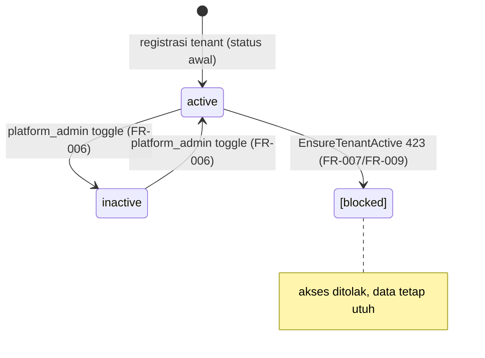

# Data Model — Platform Infrastructure: Tenants & Audit Log

**Spec**: [spec.md](./spec.md) | **Date**: 2026-08-14
**Source of truth**: [`docs/normalization/README.md`](../../docs/normalization/README.md) + [`docs/erd/tenants.md`](../../docs/erd/tenants.md) + [`docs/erd/audit_logs.md`](../../docs/erd/audit_logs.md)

Sebagian besar entitas sudah ada di codebase. Bagian ini mendokumentasikan state target (post-migrasi Langkah 2) + delta terhadap existing.

---

## Entitas

### Tenant — *existing, no schema change*

Organisasi/klinik = unit isolasi seluruh data (multi-tenant single DB, spec 001).

| Field | Tipe | Constraint | Catatan |
|-------|------|-----------|---------|
| id | bigint unsigned | PK auto | |
| name | string(255) | not null | Nama perusahaan/klinik |
| slug | string(255) | unique, not null, URL-safe | `Str::slug(name)`; reject duplikat + reserved `central` (FR-004/005) |
| phone | string(50) | nullable | Format lokal/internasional |
| status | enum(active, inactive) | default `active` | FR-006/FR-011 |
| created_at | timestamp | | |
| updated_at | timestamp | | |

- **Index**: `slug` UNIQUE.
- **Relasi**: hasMany `users` + semua entitas tenant-scopeable via `tenant_id`.
- **State transitions**: `active` ↔ `inactive` (FR-006). Hapus permanen di luar scope v1 (FR-011).
- **Delete rule**: semua FK `tenant_id` child `cascadeOnDelete` (revisi); operasi hapus tenant di luar scope v1.
- **Central tenant**: baris khusus slug `central` (seeded), titik masuk platform (FR-001). Admin platform = user pada central tenant dengan `role = platform_admin`.

### User (platform_admin) — *existing, no schema change*

User pada central tenant dengan `role = UserRole::PlatformAdmin`. Pelaku aksi administratif lintas tenant. Ter-autentikasi via `POST /central/login` (Sanctum token).

- Field relevan: `id, tenant_id (→central), name, email, password, role=platform_admin, status=active, clinic_role (nullable)`.
- Helper: `isPlatformAdmin()` (existing).

### User (tenant_admin) — *existing, no schema change*

User admin pertama dibuat saat registrasi tenant. `role = UserRole::TenantAdmin`, terikat ke tenant baru via `tenant_id`.

- Dibuat atomik bersama tenant dalam `TenantRegistrationService::register()` (DB transaction).

### Activity (AuditLog) — *Langkah 2: migrasi native → spatie*

Record aksi kritis (FR-013). Target: `App\Models\Activity extends Spatie\Activitylog\Models\Activity`, `protected $table = 'audit_logs'`.

| Field | Tipe | Constraint | Catatan |
|-------|------|-----------|---------|
| id | bigint unsigned | PK auto | |
| log_name | string, nullable | | Namespace modul: `tenant`, `auth`, `user`, `patient`, `booking`, `transaction`, `medical_record` |
| description | string | not null | Action code: `tenant.registered`, `user.login`, `tenant.status_changed`, dst. (rename dari native `action`) |
| subject_id | bigint unsigned, nullable | morph | Model target — `performedOn($model)` |
| subject_type | string, nullable | morph | Otomatis dari class subject |
| causer_id | bigint unsigned, nullable | morph | User pelaku; nullable untuk aksi anonim (registrasi publik) — `causedBy($user)` |
| causer_type | string, nullable | morph | Otomatis dari class causer |
| properties | json, nullable | | Context: `tenant_id`, slug, ip_address, status lama/baru — `withProperties([...])` |
| created_at | timestamp | | |
| updated_at | timestamp | | |

- **Tidak ada FK DB** (morph). `causer_id`/`subject_id` bukan constrained FK → user/pasien di-soft/hard-delete **tidak** memutus audit (FR-016). Resolve morph return null bila target hilang.
- **`tenant_id`** disimpan di `properties->tenant_id` (bukan kolom eksplisit, FR-019). Query: `Activity::where('properties->tenant_id', $tenantId)`.
- **Immutable, tidak pernah hapus** (FR-016).
- `ponytail: index JSON path properties->tenant_id add saat lambat`.

### Delta vs existing native audit_logs

| Native (saat ini) | Spatie (target) |
|---|---|
| `action` (string) | `description` (rename) |
| `tenant_id` (kolom eksplisit, index) | `properties->tenant_id` (drop kolom) |
| `causer_id` FK→users nullOnDelete | `causer_id` + `causer_type` morph (drop FK) |
| `subject_type` + `subject_id` morphs | tetap (sama) |
| `properties` json | tetap (sama) + tambah `tenant_id` di dalamnya |
| — | `log_name` (kolom baru) |
| `AuditLog::create([...])` | `activity()->...->log($action)` via `LogAuditAction` |

---

## Wrapper LogAuditAction — *Langkah 2: isi diubah, signature tetap*

`App\Actions\LogAuditAction::handle(string $action, ?Model $subject=null, ?User $causer=null, array $context=[], ?Tenant $tenant=null)`.

Isi `handle()` diubah dari `AuditLog::create([...])` ke:
```php
activity()
    ->causedBy($causer)           // nullable → aksi anonim
    ->performedOn($subject)       // nullable
    ->withProperties(array_merge(
        $context,
        $tenant ? ['tenant_id' => $tenant->id] : [],
    ))
    ->log($action);               // log_name bisa di-turunkan dari prefix action (mis. `tenant.*` → `tenant`)
```

Semua caller (18 controller/service) **tidak berubah** signature-nya — wrapper menyerap perubahan backend. `App\Models\AuditLog` dihapus post-migrasi (diganti `App\Models\Activity`).

## State Transitions (Tenant)



Hapus permanen tenant di luar scope v1 (FR-011).