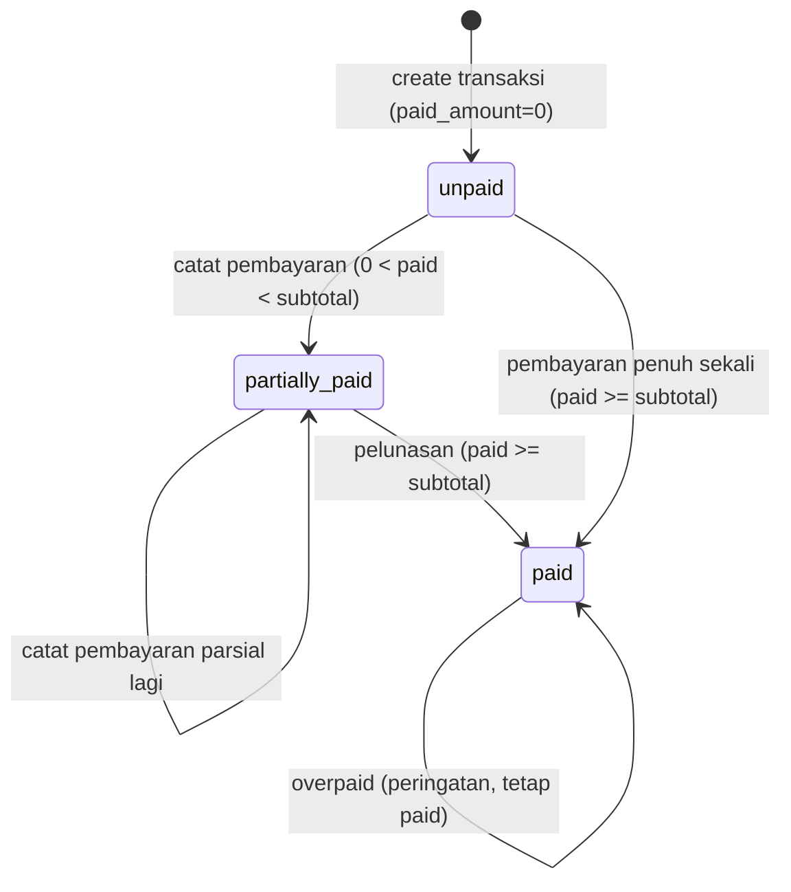

# Data Model: Integritas Item Transaksi, Pembayaran Cicilan & Cetak Invoice

**Date**: 2026-08-14 | **Spec**: [spec.md](spec.md) | **Sumber kebenaran**: `docs/erd/transaction_items.md`, `docs/erd/payments.md`, `docs/erd/invoices.md`, `docs/erd/README.md`, `docs/normalization/README.md`

## Perubahan skema

Spec 011 hanya mengubah skema `transaction_items` (CHECK + FK restrict). `payments` tidak berubah (sudah ada dari 008). `invoices` di-merge (F0, tabel dihapus di 008) — `issued_at` di `transactions`.

## Entity: `transaction_items` (REVISI)

Line item penjualan. Revisi: CHECK exclusive arc + FK restrict master.

| Field | Tipe | Constraint | Catatan |
|-------|------|-----------|---------|
| id | bigint unsigned | PK | |
| tenant_id | bigint unsigned | FK→tenants, not null | BelongsToTenant; invariant = tenant transaksi (anomali #3) |
| transaction_id | bigint unsigned | FK→transactions, not null, cascadeOnDelete | child admin |
| product_id | bigint unsigned | FK→products, nullable, **restrictOnDelete** (was nullOnDelete) | XOR service_id |
| service_id | bigint unsigned | FK→services, nullable, **restrictOnDelete** (was nullOnDelete) | XOR product_id |
| name | string(255) | not null | R6 snapshot |
| unit_price | decimal(12,2) | not null | R6 snapshot (FR-056) |
| qty | integer | not null, >0 | |
| subtotal | decimal(12,2) | not null | unit_price * qty |
| created_at | timestamp | | |
| updated_at | timestamp | | |

### Constraint baru (migration)

- **CHECK** `((product_id IS NULL) <> (service_id IS NULL))` — exclusive arc anomali #1. Tepat satu terisi.
- FK `product_id`/`service_id`: `nullOnDelete` → **`restrictOnDelete`** (drop+recreate constraint di PostgreSQL; SQLite skip).
- Index (sudah ada, tidak berubah): `(tenant_id, transaction_id)`, `(tenant_id, product_id)`, `(tenant_id, service_id)`.

### Invariant

- **R9 exclusive arc**: DB CHECK + app validation (`TransactionRequest` `required_without` + `prohibits`).
- **R6 snapshot**: `name`+`unit_price` immutable setelah create. Tidak ada path sync ke master.
- **Anomali #3 tenant**: create via `$transaction->items()->create()` → `tenant_id` inherit. App-level + test.

### Validation rules (TransactionRequest — sudah ada)

| Field | Rule |
|-------|------|
| items.*.product_id | nullable, exists:products,id; XOR service_id |
| items.*.service_id | nullable, required_without:items.*.product_id, prohibits:items.*.product_id, exists:services,id |
| items.*.name | required, string, max:255 |
| items.*.unit_price | required, decimal, >=0 |
| items.*.qty | required, integer, gt:0 |
| items.*.subtotal | (computed backend, tidak dari input) |

## Entity: `payments` (tidak berubah)

Pembayaran transaksi. Sudah ada dari 008.

| Field | Tipe | Constraint | Catatan |
|-------|------|-----------|---------|
| id | bigint unsigned | PK | |
| tenant_id | bigint unsigned | FK→tenants, not null | BelongsToTenant; invariant = tenant transaksi |
| transaction_id | bigint unsigned | FK→transactions, not null, cascadeOnDelete | child admin |
| method | enum(cash,transfer,qris,debit) | not null | FR-054 |
| amount | decimal(12,2) | not null, >0 | |
| paid_at | datetime | not null | laporan omzet (FR-070) |
| created_at | timestamp | | |
| updated_at | timestamp | | |

### Invariant

- **paid_amount sync** (di `transactions`, denormalized): `PayTransactionAction` update `paid_amount += amount` + set `payment_status` 3-state dalam `DB::transaction` + `lockForUpdate`.
- **Anomali #3 tenant**: create via `$transaction->payments()->create()` → `tenant_id` inherit.

### Validation rules (PaymentRequest — sudah ada)

| Field | Rule |
|-------|------|
| method | required, Enum(PaymentMethod) |
| amount | required, numeric, gt:0 |
| paid_at | required, date |

## Entity: `transactions` (tidak berubah oleh 011)

Konteks: `paid_amount` decimal(12,2) default 0, `payment_status` enum(unpaid,partially_paid,paid), `issued_at` datetime nullable (F0 merge), `invoice_number` unique per tenant, soft delete. Sudah ada dari 008.

### State transition: `payment_status`



Aturan (FR-055, `PayTransactionAction::resolveStatus`):
- `paid_amount <= 0` → `unpaid`
- `0 < paid_amount < subtotal` → `partially_paid`
- `paid_amount >= subtotal` → `paid`

## Entity: `invoice` (merged — bukan tabel)

F0 keputusan: MERGE. `issued_at` pada `transactions`. Tabel `invoices` dihapus (008). Konten invoice dirender dari relasi (R4): `transaction` + `transaction_items` + `payments` + `tenant` + `patient` + `cashier`. Tidak ada kolom duplikat.

### Render contract (InvoiceService::render — sudah ada)

```php
['tenant','patient','cashier','items','payments','subtotal','invoice_number','issued_at']
```

Semua dari relasi transaksi. `issued_at` fallback `created_at` bila null.

## FK delete rules (rekap)

| Tabel | FK | Sebelum | Sesudah (011) | Alasan |
|-------|-----|---------|---------------|--------|
| transaction_items | transaction_id | cascadeOnDelete | cascadeOnDelete (tetap) | child admin |
| transaction_items | product_id | nullOnDelete | **restrictOnDelete** | master diarsip, bukan hapus; snapshot + laporan terjaga |
| transaction_items | service_id | nullOnDelete | **restrictOnDelete** | sama |
| transaction_items | tenant_id | cascadeOnDelete | cascadeOnDelete (tetap) | hapus tenant = hapus semua |
| payments | transaction_id | cascadeOnDelete | cascadeOnDelete (tetap) | child admin |
| payments | tenant_id | cascadeOnDelete | cascadeOnDelete (tetap) | hapus tenant = hapus semua |

## Multi-tenant isolation

Semua entitas (`transaction_items`, `payments`) pakai `BelongsToTenant` trait → `TenantScope` global scope filter `tenant_id` dari `app('tenant')`. Create via relasi parent → `tenant_id` inherit. Tidak ada query lintas-tenant. Test assert invariant (anomali #3).